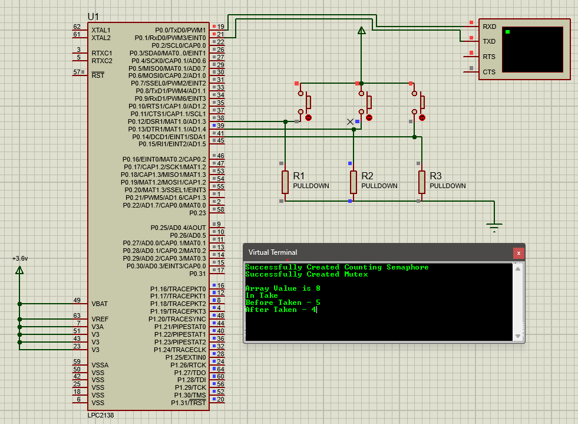

\# 🚦 LPC2138 FreeRTOS Counting Semaphore \& Mutex Demo


<p align="center">

&nbsp; 

</p>


---


\## 📄 Table of Contents


\- \[Overview](#overview)

\- \[Schematic](#schematic)

\- \[Features](#features)

\- \[Hardware Connections](#hardware-connections)

\- \[Code Explanation](#code-explanation)

\- \[Switch Behavior](#switch-behavior)

\- \[UART Configuration](#uart-configuration)

\- \[Build \& Run](#build--run)

\- \[Code](#code)

\- \[Repository Structure](#repository-structure)

\- \[License](#license)

\- \[Author](#author)

\- \[Contact](#contact)


---


\## ✅ Overview


This project demonstrates the usage of \*\*FreeRTOS counting semaphores and mutexes\*\* on an LPC2138 microcontroller. It simulates shared resource access using three push-button switches and outputs informative debug messages via UART to a virtual terminal.


---


\## 💡 Schematic


The project schematic is shown below (exported from Proteus):


<p align="center">

&nbsp; 

</p>


---


\## ✨ Features


\- Uses \*\*counting semaphore\*\* to control access to a resource (array `a\[]`).

\- Uses \*\*mutex\*\* to protect critical sections and prevent race conditions.

\- Provides real-time feedback over UART.

\- Demonstrates multitasking using FreeRTOS tasks.


---


\## ⚡ Hardware Connections


| Component         | LPC2138 Pin      | Description                         |

|-------------------|------------------|-------------------------------------|

| Switch 1          | P0.12            | Semaphore Take Task 1               |

| Switch 2          | P0.14            | Semaphore Give Task                 |

| Switch 3          | P0.13            | Semaphore Take Task 2               |

| UART0 TX          | TXD0 (P0.0)      | UART transmit to terminal          |

| UART0 RX          | RXD0 (P0.1)      | UART receive (optional)            |

| Pull-down resistors | All switches   | Ensures proper logic level when unpressed |


---


\## 🧑‍💻 Code Explanation


\### Semaphores


\- \*\*Counting Semaphore (`m`)\*\*: Controls access to the shared array `a\[]`. Initialized with a count of 5.

\- \*\*Mutex (`m2`)\*\*: Provides mutual exclusion during display and data updates.


\### Tasks


\- \*\*lcd1 (Switch 1)\*\*: Takes the counting semaphore, displays array value and semaphore count before \& after taking.

\- \*\*lcd3 (Switch 3)\*\*: Similar to lcd1, operates with a different switch.

\- \*\*lcd2 (Switch 2)\*\*: Releases (gives) the counting semaphore, displays count before \& after giving.


\### Shared Resource


\- \*\*Array `a\[5]`\*\*: Holds values `{8, 3, 5, 6, 7}` which are accessed sequentially.


---


\## 🎛️ Switch Behavior


| Switch   | Action                               |

|-----------|------------------------------------|

| Switch 1 | Take counting semaphore \& display array value |

| Switch 2 | Give counting semaphore back         |

| Switch 3 | Take counting semaphore \& display array value |


---


\## 🔧 UART Configuration


\- Baud rate: \*\*9600 bps\*\*

\- Settings: \*\*8 data bits, no parity, 1 stop bit\*\*


```c

U0LCR = 0x83; // Enable DLAB

U0DLL = 98;   // Set baud rate divisor for 9600

U0DLM = 0;

U0LCR = 0x03; // Disable DLAB, 8-bit data 


``` 


\## ⚙️ Build \& Run

Hardware Setup (Proteus or real board)

\- Connect switches to P0.12, P0.13, and P0.14 with pull-down resistors.

\- Connect UART0 TX pin to a virtual terminal (Proteus) or a USB-UART converter.


\## Build


\- Use Keil uVision or your preferred IDE.

\- Compile the provided main.c.


\## Load \& Simulate


\- Load hex file to LPC2138 in Proteus or on hardware.

\- Start simulation or power on the board.


\## Interact


\- Press switches and observe UART terminal messages.


\## 💻 Code

```c

\#include "FreeRTOS.h"

\#include "task.h"

\#include "semphr.h"


int a\[5] = {8, 3, 5, 6, 7};

int index = 0;


void lcd1(void \*parm);

void lcd2(void \*parm);

void lcd3(void \*parm);

void display(const char \*);

void trans(char);


SemaphoreHandle\_t m, m2;


int main()

{

&nbsp;   PINSEL0 = 1 | 1 << 2;

&nbsp;   U0LCR = 0x83;

&nbsp;   U0DLL = 98;

&nbsp;   U0DLM = 0;

&nbsp;   U0LCR = 0x03;


&nbsp;   PINSEL1 = 0;

&nbsp;   IO0DIR = 0;

&nbsp;   IO1DIR = ~0;


&nbsp;   m = xSemaphoreCreateCounting(5, 5);

&nbsp;   if (m == NULL)

&nbsp;       display("Failed To Create Counting Semaphore\\r\\n");

&nbsp;   else

&nbsp;       display("Successfully Created Counting Semaphore\\r\\n");


&nbsp;   m2 = xSemaphoreCreateMutex();

&nbsp;   if (m2 == NULL)

&nbsp;       display("Failed To Create Mutex\\r\\n");

&nbsp;   else

&nbsp;       display("Successfully Created Mutex\\r\\n");


&nbsp;   xTaskCreate(lcd1, "Task1", 90, NULL, 0, NULL);

&nbsp;   xTaskCreate(lcd2, "Task2", 90, NULL, 0, NULL);

&nbsp;   xTaskCreate(lcd3, "Task3", 90, NULL, 0, NULL);


&nbsp;   vTaskStartScheduler();

&nbsp;   while (1);

}


void trans(char a)

{

&nbsp;   while ((U0LSR \& (1 << 5)) == 0);

&nbsp;   U0THR = a;

}


void display(const char \*a)

{

&nbsp;   while (\*a)

&nbsp;   {

&nbsp;       trans(\*a++);

&nbsp;   }

}


void lcd1(void \*parm)

{

&nbsp;   char b;

&nbsp;   while (1)

&nbsp;   {

&nbsp;       if ((IO0PIN \& (1 << 12)) == (1 << 12))

&nbsp;       {

&nbsp;           b = uxSemaphoreGetCount(m);

&nbsp;           if (xSemaphoreTake(m, 1000) == 1)

&nbsp;           {

&nbsp;               if (xSemaphoreTake(m2, 3000) == 1)

&nbsp;               {

&nbsp;                   display("\\r\\nArray Value is ");

&nbsp;                   trans(a\[index++] + 48);

&nbsp;                   if (index == 5) index = 0;

&nbsp;                   display("\\rIn Take");

&nbsp;                   display("\\rBefore Taken - ");

&nbsp;                   trans(b + 48);

&nbsp;                   b = uxSemaphoreGetCount(m);

&nbsp;                   display("\\rAfter Taken - ");

&nbsp;                   trans(b + 48);

&nbsp;                   xSemaphoreGive(m2);

&nbsp;               }

&nbsp;               while ((IO0PIN \& (1 << 12)) == (1 << 12));

&nbsp;           }

&nbsp;       }

&nbsp;   }

}


void lcd3(void \*parm)

{

&nbsp;   char b;

&nbsp;   while (1)

&nbsp;   {

&nbsp;       if ((IO0PIN \& (1 << 13)) == (1 << 13))

&nbsp;       {

&nbsp;           b = uxSemaphoreGetCount(m);

&nbsp;           if (xSemaphoreTake(m, 1000) == 1)

&nbsp;           {

&nbsp;               if (xSemaphoreTake(m2, 3000) == 1)

&nbsp;               {

&nbsp;                   display("\\r\\nArray Value is ");

&nbsp;                   trans(a\[index++] + 48);

&nbsp;                   if (index == 5) index = 0;

&nbsp;                   display("\\rIn Take");

&nbsp;                   display("\\rBefore Taken - ");

&nbsp;                   trans(b + 48);

&nbsp;                   b = uxSemaphoreGetCount(m);

&nbsp;                   display("\\rAfter Taken - ");

&nbsp;                   trans(b + 48);

&nbsp;                   xSemaphoreGive(m2);

&nbsp;               }

&nbsp;               while ((IO0PIN \& (1 << 13)) == (1 << 13));

&nbsp;           }

&nbsp;       }

&nbsp;   }

}


void lcd2(void \*parm)

{

&nbsp;   char b;

&nbsp;   while (1)

&nbsp;   {

&nbsp;       if ((IO0PIN \& (1 << 14)) == (1 << 14))

&nbsp;       {

&nbsp;           if (xSemaphoreTake(m2, 3000) == 1)

&nbsp;           {

&nbsp;               b = uxSemaphoreGetCount(m);

&nbsp;               display("\\rIn give");

&nbsp;               display("\\rBefore Given - ");

&nbsp;               trans(b + 48);

&nbsp;               xSemaphoreGive(m);

&nbsp;               b = uxSemaphoreGetCount(m);

&nbsp;               display("\\rAfter Given - ");

&nbsp;               trans(b + 48);

&nbsp;               while ((IO0PIN \& (1 << 14)) == (1 << 14));

&nbsp;               xSemaphoreGive(m2);

&nbsp;           }

&nbsp;       }

&nbsp;   }

}


```


\## 📁 Repository Structure

```

.

├── schematic.png

├── main.c

├── README.md


```


\## ⚖️ License


This project is open-source and free to use for academic and research purposes.


\## 👨‍💻 Author


Anandhu-AKR


\## 📬 Contact


For questions or contributions, feel free to create an issue or reach me directly via your email or your GitHub profile link.


\## ⭐ Support


If you like this project, please consider giving it a star!


